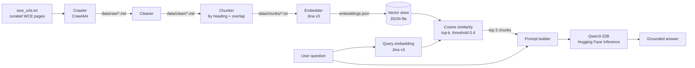

# 🎓 College Assistant — WCE AI Chatbot (RAG)

An AI assistant that answers questions about **Walchand College of Engineering (WCE), Sangli** using only information from the college's own website. It is built as a **Retrieval-Augmented Generation (RAG)** pipeline: it crawls official WCE pages, turns them into searchable embeddings, retrieves the most relevant passages for a question, and asks an LLM to answer **strictly from that context**.


---

## ✨ Features

- **Automated data collection**: crawls a curated list of official WCE URLs (about, admissions, academics, departments, student life, notices, careers) and saves each page as Markdown using [Crawl4AI](https://github.com/unclecode/crawl4ai).
- **Cleaning pipeline**: strips site navigation, footer/share sections and image-only Markdown, and normalises blank lines, leaving just the page content.
- **Heading-aware chunking**: splits pages by `##` sections, then splits long sections into ~3000-character chunks with 300-character overlap so context isn't cut mid-thought.
- **Semantic search**: embeds chunks and queries with **Jina `jina-embeddings-v3`** (using its separate `retrieval.passage` and `retrieval.query` modes) and ranks by **cosine similarity**.
- **Token-safe embedding**: token-aware batching and splitting keeps every request under the embedding API's token limits.
- **Grounded answers**: the prompt instructs the LLM (**Qwen3-32B** via Hugging Face Inference) to answer *only* from the retrieved context, and to say so when the answer isn't there, which reduces hallucination.
- **Relevance guard**: results below a similarity threshold (0.4) are dropped. If nothing relevant is found, the assistant says so instead of guessing.

---

## 🏗️ Architecture



**Two phases**

1. **Indexing (run once, or when the website changes):** crawl → clean → chunk → embed
2. **Querying (every question):** embed the question → find the top matching chunks → give them to the LLM as context → return the answer

---

## 🧰 Tech Stack

| Stage | Technology |
|-------|-----------|
| Web crawling | Crawl4AI (`AsyncWebCrawler`, headless browser) |
| Text processing | Python, regex, Markdown |
| Tokenisation | tiktoken |
| Embeddings | Jina AI `jina-embeddings-v3` (REST API) |
| Retrieval | Cosine similarity over a JSON vector store |
| LLM | `Qwen/Qwen3-32B` via Hugging Face `InferenceClient` |
| Config | python-dotenv |

---

## 🗂️ Project Structure

```
College_Assistant/
├── data/
│   └── urls/wce_urls.txt      # Curated list of WCE pages to crawl (26 URLs, grouped by topic)
├── scraper/
│   ├── crawler.py             # Crawl a single URL → data/raw/<page>.md
│   ├── collect.py             # Crawl every URL in wce_urls.txt
│   ├── cleaner.py             # data/raw → data/clean (remove nav/footer/images)
│   └── chunker.py             # data/clean → data/chunks (heading-based, with overlap)
├── embeddings/
│   └── embedder.py            # data/chunks → data/embeddings/embeddings.json
├── retrieval/
│   └── search.py              # Query embedding + cosine-similarity search
├── generation/
│   ├── generate.py            # Full RAG: retrieve + prompt + answer
│   └── test_llm.py            # Quick check that the LLM connection works
├── requirements.txt
└── .env.example
```

Generated folders (`data/raw`, `data/clean`, `data/chunks`, `data/embeddings`) are git-ignored and created when you run the pipeline.

---

## 🚀 Getting Started

### Prerequisites
- Python 3.10+
- A **[Jina AI](https://jina.ai/embeddings/)** API key (embeddings)
- A **[Hugging Face](https://huggingface.co/settings/tokens)** access token (LLM inference)

### 1. Clone and install
```bash
git clone https://github.com/PrasadK2402/College_Assistant.git
cd College_Assistant

python -m venv venv
source venv/bin/activate          # Windows: venv\Scripts\activate

pip install -r requirements.txt
crawl4ai-setup                    # installs the browser Crawl4AI needs
```

### 2. Configure environment variables
```bash
cp .env.example .env
```
Then fill in `.env`:
```env
JINA_API_KEY=your_jina_api_key
HF_TOKEN=your_huggingface_token
```

### 3. Build the knowledge base
Run these from the **project root**, in order:
```bash
python scraper/collect.py          # 1. crawl all URLs  → data/raw
python scraper/cleaner.py          # 2. clean pages     → data/clean
python scraper/chunker.py          # 3. chunk pages     → data/chunks
python embeddings/embedder.py      # 4. create embeddings → data/embeddings/embeddings.json
```

Crawl a single page instead:
```bash
python scraper/crawler.py "https://walchandsangli.ac.in/about/vision-mission/"
```

### 4. Ask questions
```bash
python -m generation.generate
```
```
Ask question about WCE: <your question here>
```

To see only the retrieved sources and similarity scores (no LLM call):
```bash
python -m retrieval.search
```

---

## ⚙️ How the RAG Pipeline Works

| Setting | Value | Where |
|---------|-------|-------|
| Chunk size / overlap | 3000 / 300 characters | `scraper/chunker.py` |
| Max tokens per chunk sent to embedder | 6000 | `embeddings/embedder.py` |
| Max tokens per embedding batch | 7500 | `embeddings/embedder.py` |
| Embedding model | `jina-embeddings-v3` | `embedder.py`, `search.py` |
| Retrieved chunks (`top_k`) | 3 | `retrieval/search.py` |
| Similarity threshold | 0.4 | `retrieval/search.py` |
| LLM | `Qwen/Qwen3-32B` | `generation/generate.py` |

**Prompt strategy:** the LLM gets the retrieved chunks (each labelled with its source file and relevance score) and is told to use *only* that context. If the answer isn't present it must say it couldn't find it.

**Adding more content:** add URLs to `data/urls/wce_urls.txt` (lines starting with `#` are comments and group URLs by topic), then re-run steps 3 onward.

---

## 🗺️ Roadmap

- [ ] Web / chat interface (FastAPI backend + React frontend) and deployment
- [ ] Show source links alongside each answer
- [ ] Section-level embeddings (embed each `##` chunk separately for sharper retrieval)
- [ ] Replace the JSON store with a vector database (FAISS / ChromaDB / pgvector)
- [ ] Conversation memory for follow-up questions
- [ ] Scheduled re-crawling to keep notices and admissions info fresh
- [ ] Evaluation set of sample WCE questions to measure answer quality
- [ ] Hybrid search (keyword + semantic) and a reranker

---

## 👤 Author

**Prasad** — B.Tech Information Technology, Walchand College of Engineering, Sangli
GitHub: [@PrasadK2402](https://github.com/PrasadK2402)
